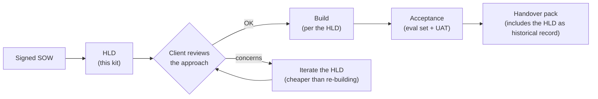
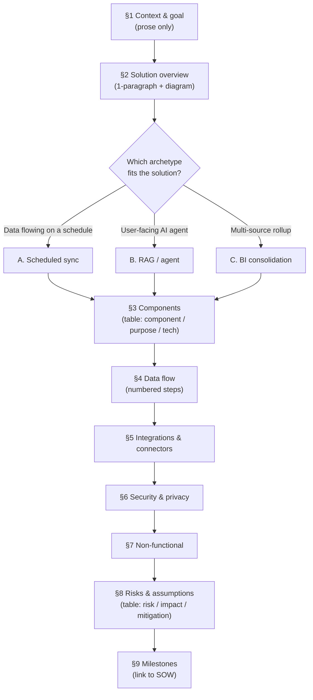
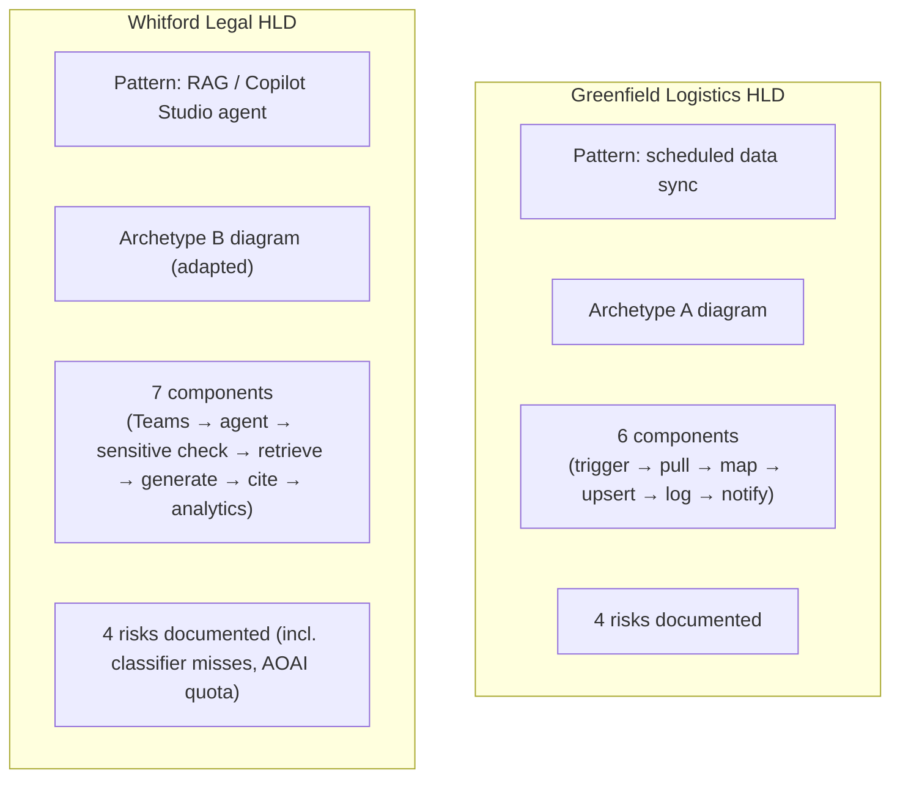
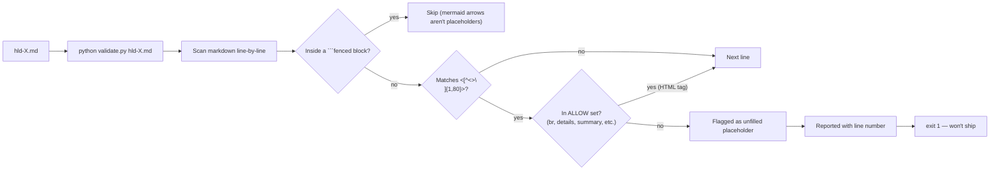

# Diagrams

This is a templates kit — the diagrams here are about how the HLD fits
into an engagement, not about a runnable system. (The actual
*architecture diagram* archetypes live in
[`diagram-template.md`](../diagram-template.md) — that's what you put
in your client's HLD.)

## 1. Where the HLD sits in the engagement lifecycle

## 2. HLD sections — and which diagram archetype each typically pairs with

## 3. The two worked HLDs at a glance

The two examples bracket the spectrum: a deterministic data-pipeline
build versus an AI-agent build with sensitive-topic escalation. Most
engagements fit one of these patterns or a small composition of them.

## 4. Validator behaviour — what it does and doesn't catch

The validator gates the "I forgot to fill in the client name" class of
mistake. It does NOT validate content correctness — that's what the
client review is for.
