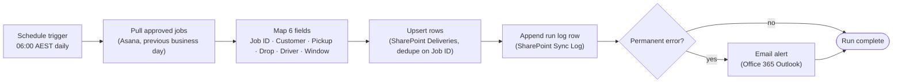

# High-Level Design — Greenfield Logistics: Asana → SharePoint daily sync

**Client:** Greenfield Logistics Pty Ltd · **Author:** Derek G. · **Date:** 2026-07-09 · **Status:** Approved for build (sign-off in SOW v1.0)

## 1. Context & goal
Greenfield Logistics' ops coordinator manually copies approved dispatch jobs
from Asana into a SharePoint "Deliveries" list every morning. This HLD
documents a Power Automate scheduled flow that replaces the manual copy
end-to-end, saving ~30 minutes/day and eliminating duplicate/missed rows.
Users: the ops coordinator (primary) and ops manager (read-only oversight).

## 2. Solution overview
A Power Automate scheduled flow runs at 06:00 AEST, queries the Asana
"Dispatch" project for jobs approved on the previous business day, maps the
six configured fields, and upserts rows into the SharePoint "Deliveries"
list deduped on `Job ID`. A second "Sync Log" SharePoint list records every
run (success/failure, row counts, error message). Transient connector
failures are retried up to three times; permanent failures (e.g. Asana
field rename) trigger an email alert to a configurable distribution list
and abort the run rather than write partial data.

See **§Architecture diagram** below.

## 3. Components
| Component | Purpose | Technology |
|-----------|---------|------------|
| Schedule trigger | Fires once per day at 06:00 AEST | Power Automate recurrence trigger |
| Source | Pull jobs `approved == true` from previous business day | Asana premium connector (List Tasks) |
| Mapping | Map Asana fields → SharePoint columns (six-field config) | Power Automate Select / Apply-to-each |
| Upsert | Add row if `Job ID` not present; skip otherwise | SharePoint connector (Get items + Create item, dedupe key `Job ID`) |
| Run log | Record run start, row counts, status, error | SharePoint "Sync Log" list (one row per run) |
| Failure notification | Email on permanent failure | Office 365 Outlook connector (Send email V2) |

## 4. Data flow
1. **06:00 AEST trigger fires.**
2. **Pull** the previous business day's approved jobs from Asana
   (parameterized: project = "Dispatch", filter `approved = true`,
   `approved_at >= yesterday 00:00 AEST`).
3. **Map** to SharePoint columns: `Job ID`, `Customer`, `Pickup`, `Drop`,
   `Driver`, `Window`. Drop any job missing a `Job ID` (would break dedup)
   and log it to the Sync Log with `status = "skipped: no Job ID"`.
4. **Upsert** each row into SharePoint "Deliveries": skip if `Job ID`
   already exists, otherwise create. Track `created` / `skipped_dupe`
   counts.
5. **Log + notify**: append one row to "Sync Log"
   (`run_started_at`, `status`, `rows_pulled`, `rows_created`,
   `rows_skipped_dupe`, `rows_skipped_invalid`, `error_message`).
   On permanent failure, send a notification email with the run-log row's
   contents.

## 5. Integrations & connectors
- **Asana premium connector** — OAuth on behalf of Cara Naidoo's account.
  Licensed under her Power Automate per-user plan. Project ID hard-coded in
  the flow (low churn); workspace ID parameterized via an environment
  variable.
- **SharePoint Online connector** — site `/sites/ops-sandbox` for testing,
  `/sites/ops` for production. List IDs parameterized so promotion to
  production is a flow-variable change, not a flow edit.
- **Office 365 Outlook connector** — service account for the notification
  email; recipient distribution list is parameterized so Cara can edit it
  from the flow's variables panel without help.

## 6. Security & privacy
- **Identity:** flow runs under Cara's account (per-user license already
  paid for; service-account licensing wasn't approved in the SOW). The
  Asana connection uses OAuth scopes limited to read-only on the Dispatch
  project. SharePoint write scope limited to the two named lists.
- **Data residency & sensitivity:** customer names and addresses are PII
  under the Australian Privacy Principles. M365 tenant region is Australia
  (East). No data leaves the tenant; the Asana connector runs inside the
  M365 service boundary.
- **AI data handling:** not applicable — this flow does no AI inference.
  If a future enhancement adds AI categorization, see the
  [m365-privacy-config kit](https://github.com/derekgallardo01/m365-privacy-config)
  for the configuration checklist.

## 7. Non-functional
- **Schedule/volume:** daily at 06:00 AEST; ~25–60 rows per run (peak ~120
  during the pre-Christmas season).
- **Error handling:** transient failures (HTTP 429/5xx, timeouts) retried
  up to 3 times with exponential backoff; permanent failures (4xx,
  schema/auth errors) abort the run and email the distribution list.
- **Maintainability:** non-developer-readable handover guide + Loom
  walkthrough (per SOW). All editable parameters (schedule, recipients,
  list IDs) exposed via flow variables so Cara can change them without
  flow edits.
- **Run duration target:** < 90 seconds per run at peak volume.

## 8. Risks & assumptions
| Risk / assumption | Impact | Mitigation |
|-------------------|--------|------------|
| Asana adds/renames a Dispatch column during the engagement | Field mapping breaks; runs land in the alert email | Map-step failure raises permanent error → email → 2-hr fix window during support |
| Asana connector rate-limit hit on peak days | Run takes longer or pulls partial data | Pagination is in the connector; retry-after honoured automatically; flagged in monitoring |
| Cara is on annual leave when an issue occurs | Nobody actions the alert email | Distribution list includes a secondary owner (named in handover) |
| OAuth token expires (90-day window for Asana) | Flow stops running silently | Sync Log run-count check in the runbook (monthly health check) |

## 9. Milestones
See the SOW v1.0 milestone table:
[examples/sow-greenfield-logistics.md](../../ms-delivery-discovery-kit/examples/sow-greenfield-logistics.md#5-milestones)
in the discovery & scoping kit.

## Architecture diagram

