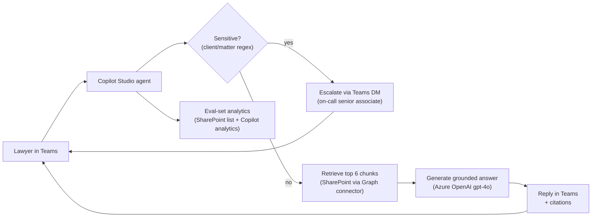

# High-Level Design — Whitford Legal: Copilot Studio knowledge agent

**Client:** Whitford Legal LLP · **Author:** Derek G. · **Date:** 2026-08-02 · **Status:** Approved for build (sign-off in SOW v1.0)

## 1. Context & goal
Whitford Legal's 60 lawyers waste hours each week hunting for internal
policy and precedent documents on SharePoint, and senior associates field
the same questions from juniors repeatedly. This HLD documents a Copilot
Studio agent in Microsoft Teams that answers questions from three approved
SharePoint sites with source citations, and escalates anything mentioning
an active client or matter to an on-call senior associate instead of
answering.

## 2. Solution overview
A Copilot Studio agent indexes three SharePoint knowledge sites
(`/sites/policies`, `/sites/precedents`, `/sites/billing-procedures`) via the
managed Microsoft 365 connector. User questions come in via Microsoft Teams
(personal scope at pilot, then a Teams app for the firm). The agent answers
using Azure OpenAI for generation, grounded only in the retrieved chunks,
with the document title + section heading rendered as the citation. A small
classifier in front of the generation step intercepts messages that contain
configured sensitive keywords (active client names, "matter number",
etc.) and routes them to an on-call senior associate via a Teams DM
instead of generating an answer.

See **§Architecture diagram** below.

## 3. Components
| Component | Purpose | Technology |
|-----------|---------|------------|
| User surface | Where lawyers type questions | Microsoft Teams (personal scope at pilot) |
| Agent | Orchestrates retrieve → classify → generate → cite | Copilot Studio agent |
| Retrieval | Index + retrieve approved chunks | Copilot Studio knowledge sources (Microsoft Graph connector to SharePoint) |
| Generation | Grounded answer with citations | Azure OpenAI (gpt-4o) under `wlf-aoai-pilot` resource group |
| Sensitive-topic classifier | Block + escalate active-client questions | Copilot Studio topic (keyword + regex) |
| Escalation | DM the on-call senior associate | Teams chat API via Power Automate |
| Eval gate | 80-case golden set, CI-runnable | Standalone Python harness in the engagement repo |

## 4. Data flow
1. **User asks a question** in Teams ("What's our NDA carve-out for IP?").
2. **Sensitive-topic check** runs first on the bare question. If a client
   name / matter-number pattern matches → skip retrieval, send Teams DM to
   the on-call senior associate, reply "I've flagged this to {senior
   associate} — they'll come back to you."
3. **Retrieval** queries the three knowledge sites; returns top 6 chunks.
4. **Generation** produces a grounded answer with `[{doc title} – {section}]`
   citations.
5. **Reply** delivered in Teams. The chat history holds three turns of
   context so follow-ups like "and the carve-out for confidentiality?" work.
6. **Analytics** logs each turn (question, was-escalated, source docs cited,
   model latency) to the agent's built-in analytics + a SharePoint list for
   the eval harness.

## 5. Integrations & connectors
- **SharePoint via Microsoft Graph connector** — app registration
  `wlf-rag-pilot` with `Sites.Selected` scope on three specific sites.
- **Azure OpenAI (`wlf-aoai-pilot`)** — gpt-4o deployment;
  "no content filtering modifications" + customer-managed no-retention
  approved by Microsoft 2026-07-30.
- **Teams chat (escalation)** — service principal posts DMs to the on-call
  senior associate; on-call rotation managed in a SharePoint list updated
  weekly by the KM partner.
- **Eval harness** — runs as part of the CI workflow in the engagement repo
  (see Whitford Legal's private `wlf-copilot-pilot` repo); gates merges.

## 6. Security & privacy
- **Identity:** the agent runs under the calling user's identity for
  retrieval (so document-level permissions still apply); only the
  escalation service principal has firm-wide DM capability, and that's
  scoped to the senior-associate rotation list.
- **Data residency:** all M365 + Azure OpenAI components are in the United
  States (US East 2) region matching the firm's existing M365 tenant. UK
  partners' data is governed by the same physical region under the firm's
  signed MSA with Microsoft.
- **AI data handling:** Azure OpenAI configured for no public-model
  training and no abuse-monitoring retention (approved by Microsoft).
  Privacy configuration is captured separately in the
  [`m365-privacy-config`](https://github.com/derekgallardo01/m365-privacy-config)
  checklist as a sign-off artefact.

## 7. Non-functional
- **Volume:** estimated 30 queries / lawyer / week at full adoption ≈
  1,800/week firm-wide. Well within Copilot Studio + Azure OpenAI quota.
- **Latency:** p50 ≤ 3s, p95 ≤ 6s for grounded answers; escalations
  return immediately.
- **Availability:** Microsoft-managed SLAs on Teams + Copilot Studio +
  Azure OpenAI. No additional uptime guarantees from this build.
- **Maintainability:** the KM partner owns the sensitive-topic keyword
  list and the on-call rotation list; both are SharePoint lists edited
  in-browser. The eval golden set is in the engagement repo; the KM
  partner reviews each PR that adds cases.

## 8. Risks & assumptions
| Risk / assumption | Impact | Mitigation |
|-------------------|--------|------------|
| Sensitive-topic classifier misses a client name | Active-matter question gets answered | Conservative defaults (escalate on uncertainty); add to eval set every time it's wrong |
| Azure OpenAI quota hit during peak hours | Higher latency / errors | Provisioned throughput already approved; monitor |
| Document indexer lag on new uploads | New policy doc takes hours to be retrievable | Documented in handover; KM partner runs a manual re-index after major policy updates |
| Lawyers paste privileged content into chat | PII leak into Azure OpenAI logs (none retained, but…) | Tenant DLP policy includes a chat content scan; agent's standing instruction says "do not paste confidential matter detail" |

## 9. Milestones
See the SOW v1.0 milestone table:
[examples/sow-whitford-legal.md](../../ms-delivery-discovery-kit/examples/sow-whitford-legal.md#5-milestones)
in the discovery & scoping kit.

## Architecture diagram

